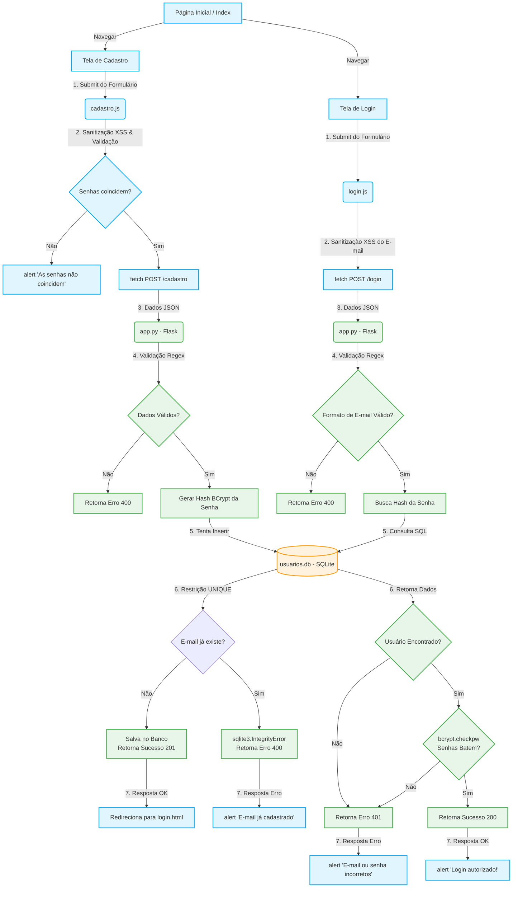

# sistema-de-cadastro
criação de um sistema para cadastro de usuários

### 🔄 Fluxo Completo do Sistema (Cadastro e Login)

```mermaid
graph TD
    %% Estilo dos Nós
    classDef front fill:#e1f5fe,stroke:#03a9f4,stroke-width:2px,color:#333;
    classDef back fill:#e8f5e9,stroke:#4caf50,stroke-width:2px,color:#333;
    classDef db fill:#fff3e0,stroke:#ff9800,stroke-width:2px,color:#333;

    %% Início
    Start[Página Inicial / Index] 
    A[Tela de Cadastro]
    AA[Tela de Login]

    Start -->|Navegar| A
    Start -->|Navegar| AA

    %% --- FLUXO DE CADASTRO ---
    A -->|1. Submit do Formulário| B(cadastro.js)
    B -->|2. Sanitização XSS & Validação| C{Senhas coincidem?}
    C -->|Não| D[alert 'As senhas não coincidem']
    C -->|Sim| E[fetch POST /cadastro]
    E -->|3. Dados JSON| F(app.py - Flask)
    F -->|4. Validação Regex| G{Dados Válidos?}
    G -->|Não| H[Retorna Erro 400]
    G -->|Sim| I[Gerar Hash BCrypt da Senha]
    I -->|5. Tenta Inserir| J[(usuarios.db - SQLite)]
    J -->|6. Restrição UNIQUE| K{E-mail já existe?}
    K -->|Sim| L[sqlite3.IntegrityError <br> Retorna Erro 400]
    K -->|Não| M[Salva no Banco <br> Retorna Sucesso 201]
    M -->|7. Resposta OK| N[Redireciona para login.html]
    L -->|7. Resposta Erro| O[alert 'E-mail já cadastrado']

    %% --- FLUXO DE LOGIN ---
    AA -->|1. Submit do Formulário| BB(login.js)
    BB -->|2. Sanitização XSS do E-mail| EE[fetch POST /login]
    EE -->|3. Dados JSON| FF(app.py - Flask)
    FF -->|4. Validação Regex| GG{Formato de E-mail Válido?}
    GG -->|Não| HH[Retorna Erro 400]
    GG -->|Sim| II[Busca Hash da Senha]
    II -->|5. Consulta SQL| J
    J -->|6. Retorna Dados| JJ{Usuário Encontrado?}
    JJ -->|Não| KK[Retorna Erro 401]
    JJ -->|Sim| LL{bcrypt.checkpw <br> Senhas Batem?}
    LL -->|Não| KK
    LL -->|Sim| MM[Retorna Sucesso 200]
    MM -->|7. Resposta OK| NN[alert 'Login autorizado!']
    KK -->|7. Resposta Erro| OO[alert 'E-mail ou senha incorretos']

    %% Aplicação de Estilos em Massa
    class Start,A,B,C,D,E,N,O,AA,BB,EE,NN,OO front;
    class F,G,H,I,L,M,FF,GG,HH,II,JJ,KK,LL,MM back;
    class J db;
```
