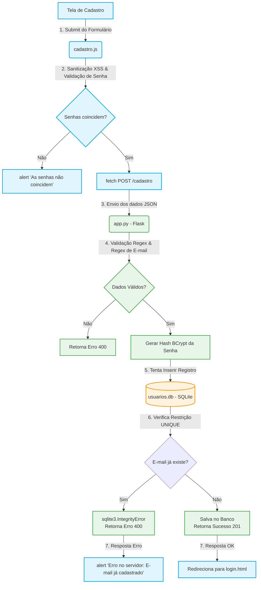

# sistema-de-cadastro
criação de um sistema para cadastro de usuários

### 🔄 Fluxo do Sistema de Autenticação

```mermaid
graph TD
    %% Estilo dos Nós
    classDef front fill:#e1f5fe,stroke:#03a9f4,stroke-width:2px,color:#333;
    classDef back fill:#e8f5e9,stroke:#4caf50,stroke-width:2px,color:#333;
    classDef db fill:#fff3e0,stroke:#ff9800,stroke-width:2px,color:#333;

    %% Elementos do Fluxo
    A[Tela de Cadastro] -->|1. Submit do Formulário| B(cadastro.js)
    B -->|2. Sanitização XSS & Validação de Senha| C{Senhas coincidem?}
    
    C -->|Não| D[alert 'As senhas não coincidem']:::front
    C -->|Sim| E[fetch POST /cadastro]:::front

    E -->|3. Envio dos dados JSON| F(app.py - Flask):::back
    F -->|4. Validação Regex & Regex de E-mail| G{Dados Válidos?}
    
    G -->|Não| H[Retorna Erro 400]:::back
    G -->|Sim| I[Gerar Hash BCrypt da Senha]:::back
    
    I -->|5. Tenta Inserir Registro| J[(usuarios.db - SQLite)]:::db
    J -->|6. Verifica Restrição UNIQUE| K{E-mail já existe?}
    
    K -->|Sim| L[sqlite3.IntegrityError <br> Retorna Erro 400]:::back
    K -->|Não| M[Salva no Banco <br> Retorna Sucesso 201]:::back

    M -->|7. Resposta OK| N[Redireciona para login.html]:::front
    L -->|7. Resposta Erro| O[alert 'Erro no servidor: E-mail já cadastrado']:::front

    %% Aplicação de Estilos
    class A,B,C,D,E,N,O front;
    class F,G,H,I,L,M back;
    class J db;
```
